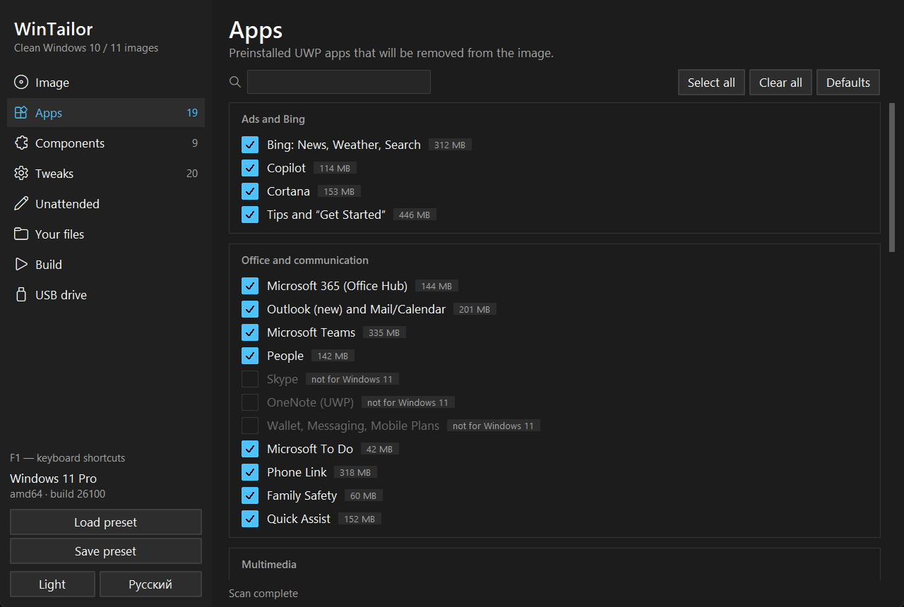
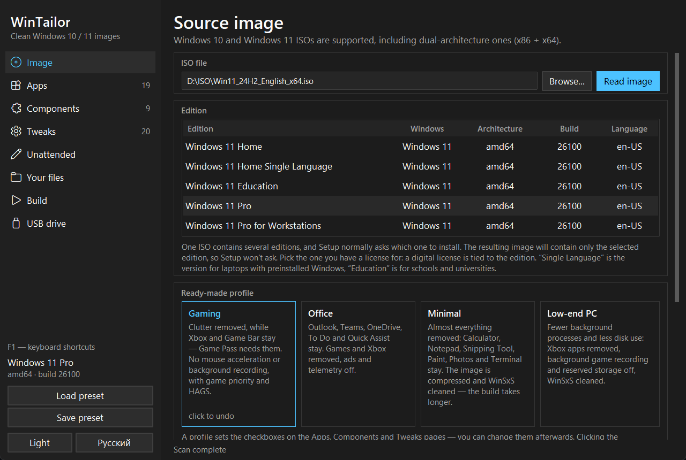
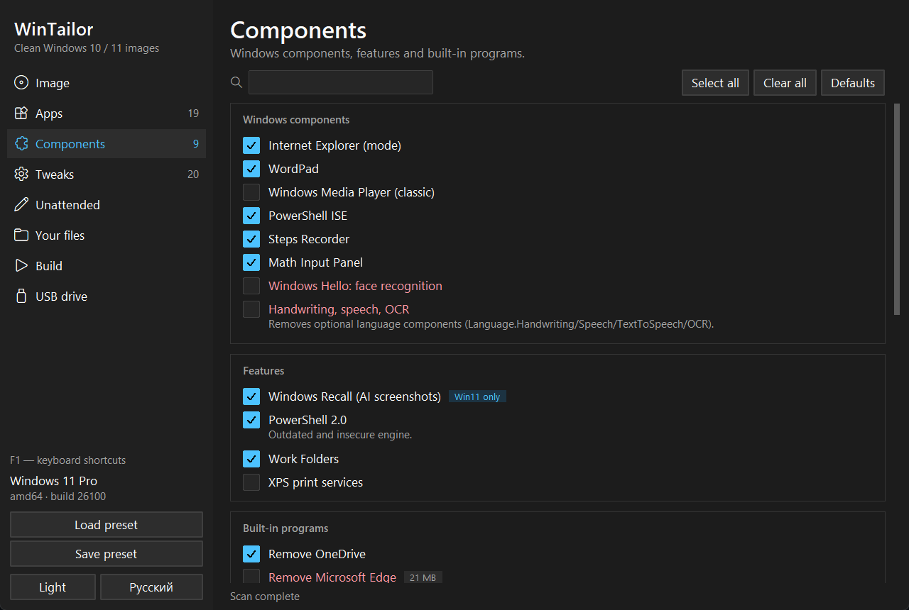
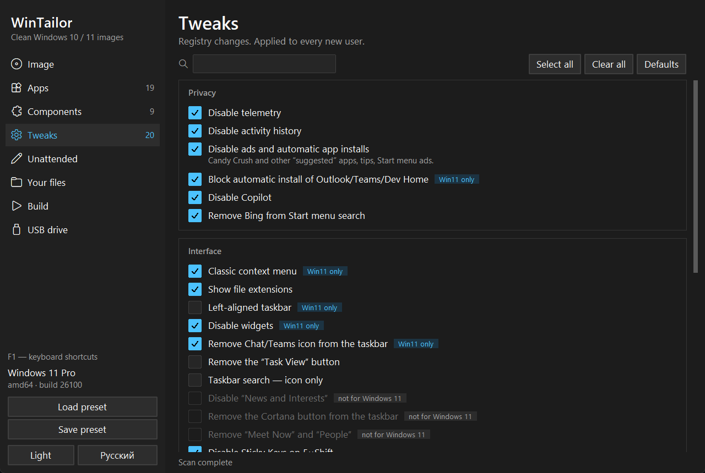
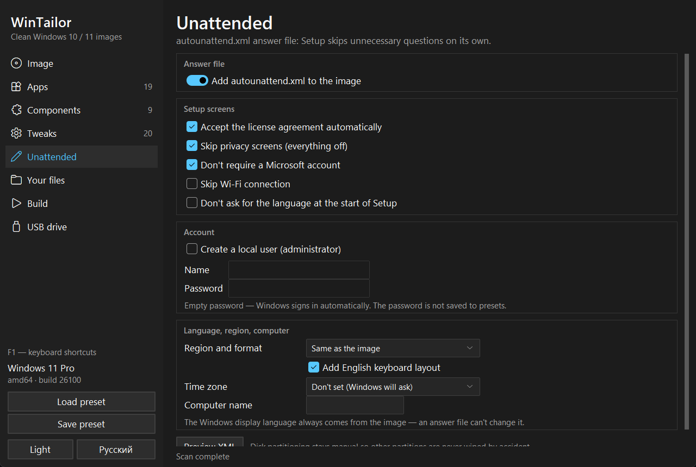
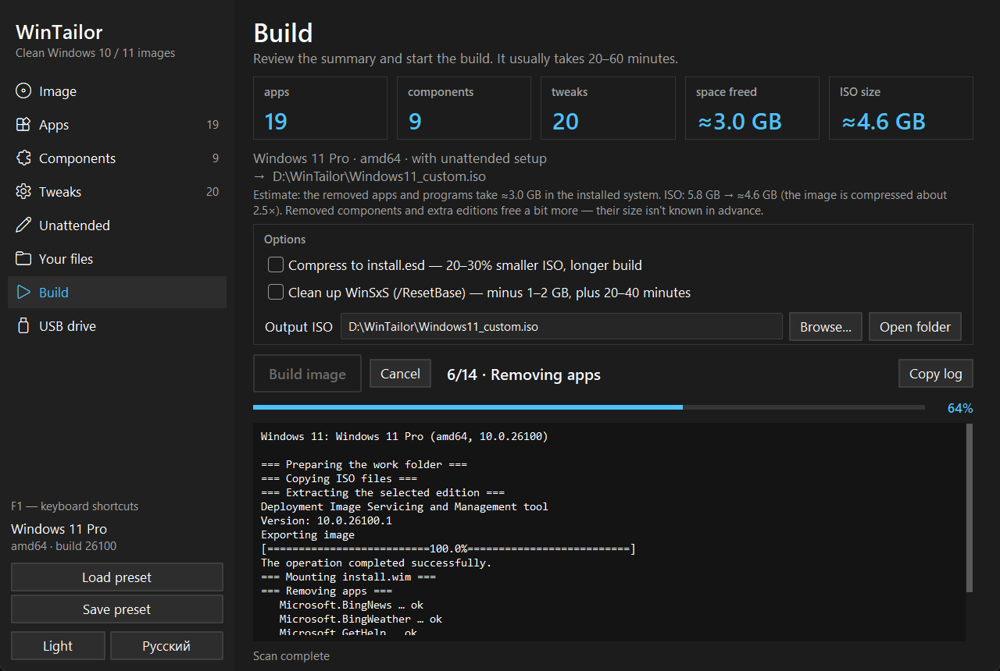
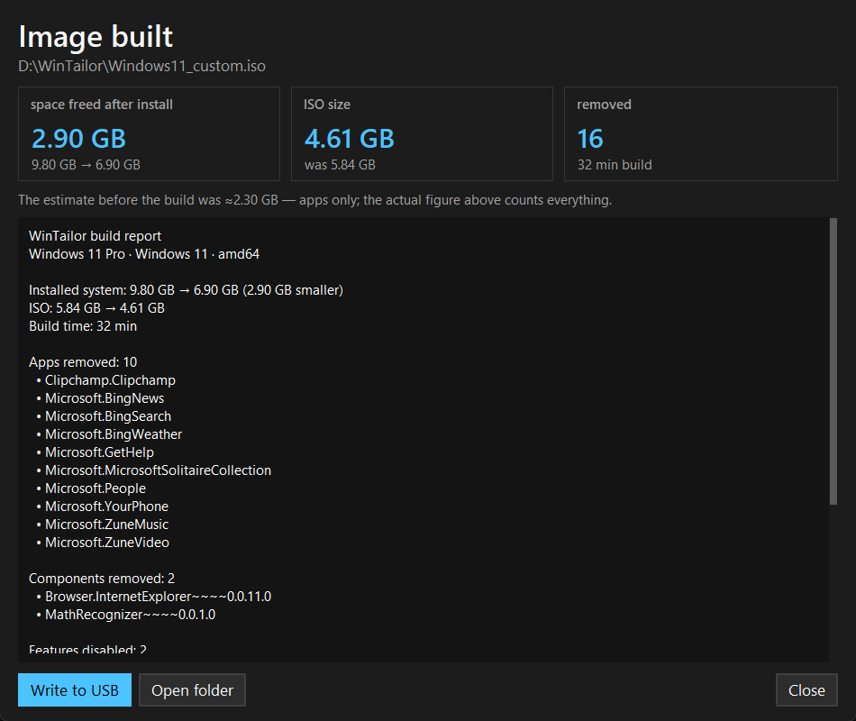
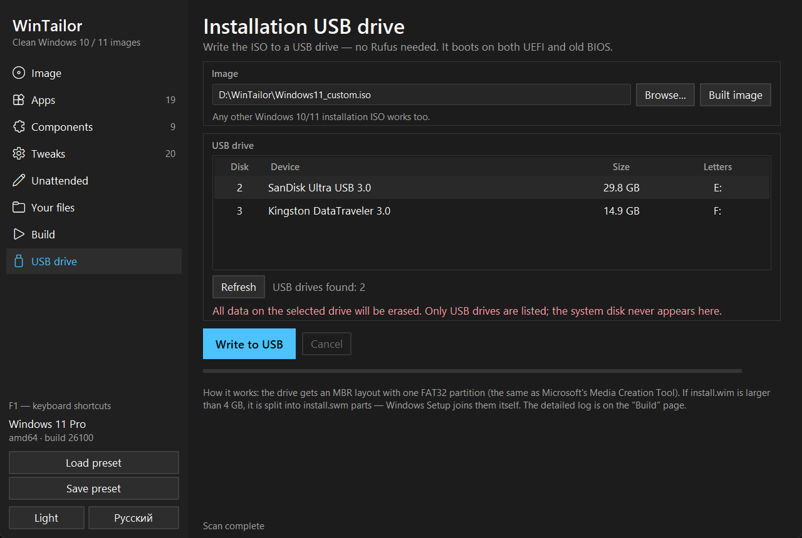
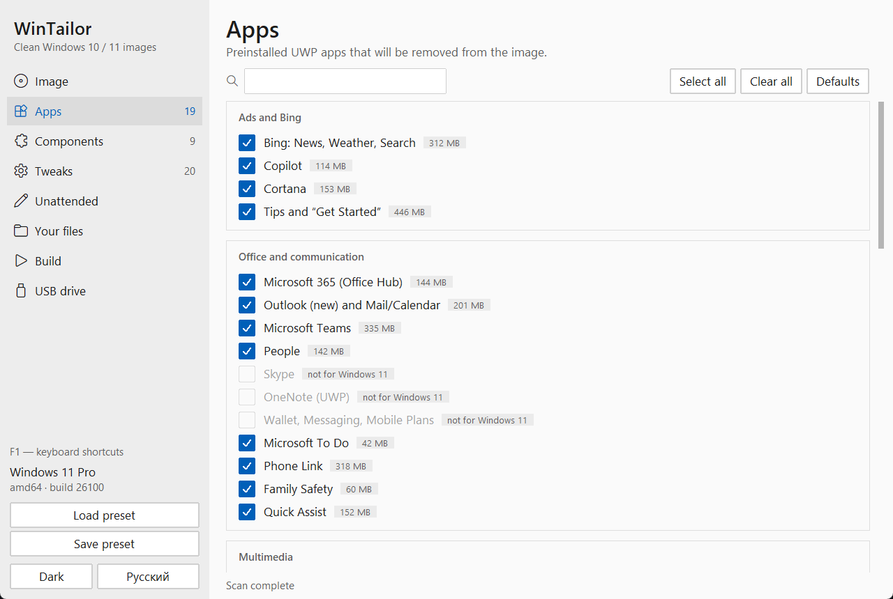

# WinTailor

[Русский](README.md) · **English**

**A clean Windows 10 and 11 — no ads, no telemetry, no bloatware.**
Pick what to remove and what to tweak — WinTailor builds an installation ISO or writes a USB drive right away.

---

## Why

A fresh Windows 11 comes with Bing in search, Copilot, Teams, Outlook, Clipchamp, games, ads in Start, telemetry and dozens of other things you have to switch off by hand after every reinstall.

WinTailor does it **once — in the image itself**. Install Windows from that drive and the system is clean from the first boot: nothing to uninstall afterwards, and every setting is already applied for each new user.

- **No scripts, no command line** — everything is a checkbox with an explanation.
- **Safe by default** — only things that can't break the system are checked. Risky items are highlighted in red and left off.
- **See what's inside the image** — WinTailor scans the ISO and shows what it actually contains and how much space each app takes.
- **No Rufus needed** — the installation USB drive is written right from the app.

## Download

1. Open the **[latest release](https://github.com/kwolex/wintailor/releases/latest)** page.
2. Download `WinTailor-…-setup.exe` — the installer (or `WinTailor-…-portable.zip` if you'd rather not install anything).
   The app will tell you about newer versions itself — a link appears in the sidebar.
3. Run it and install like any other program. No Python or anything else needed — it's all inside.

> **Windows SmartScreen** may warn that the publisher is unknown: the app doesn't have a paid code-signing certificate yet. Click **“More info” → “Run anyway”**.

## Features

| | |
|---|---|
| 🧹 **39 apps** | Bing, Copilot, Cortana, Teams, Outlook, Clipchamp, Xbox, Solitaire, Tips, Dev Home and more — with the size of each |
| ⚙️ **37 tweaks** | Telemetry, ads, widgets, classic context menu, dark theme, Start without recommendations, File Explorer without Home and Gallery, gaming optimizations |
| 🧩 **14 components** | OneDrive, Edge, Internet Explorer, WordPad, PowerShell 2.0, Recall, face recognition, handwriting and more |
| 🔍 **Image scan** | Everything that's not in the catalog is listed separately with a risk rating: “safe”, “caution”, “dangerous” |
| 🎮 **Ready-made profiles** | “Gaming”, “Office”, “Minimal”, “Low-end PC” — one click, click again to undo |
| 💻 **Install on any PC** | Bypasses the Windows 11 TPM 2.0 / Secure Boot / CPU / RAM checks; setup without internet or a Microsoft account |
| 🤖 **Unattended setup** | Skips the license and privacy screens, creates a local user, sets region, time zone and computer name |
| 📁 **Your files** | Installers, drivers, configs end up in `C:\Setup` or on the desktop right after setup. Just drag them into the window from Explorer |
| 📊 **Build report** | What was actually removed, what failed and how much smaller the system became. The full log and a SHA-256 checksum are saved next to the ISO |
| 💾 **USB writer** | Boots on both UEFI and legacy BIOS; a large `install.wim` is split automatically |
| 🧰 **Ventoy** | If the drive has [Ventoy](https://www.ventoy.net), the image is simply copied to it — no formatting, your other ISOs stay |
| 🗂️ **Several editions** | For example, Pro and Home in one ISO — Setup asks which one to install |
| ⏯️ **Resume a build** | If a build was interrupted (a crash, a power cut, “Cancel”), the next one continues where it stopped |
| 🏷️ **Manufacturer info** | Your own manufacturer, model, support details and logo in “Settings → System → About” |
| 🔄 **One-click update** | The program downloads and installs the new version itself |
| 🔔 **No need to watch the screen** | Tray icon with build progress, a notification and sound when done, optionally straight to writing a USB drive |

Russian and English UI, dark and light themes, presets, keyboard shortcuts (F1 for the list). Your checkboxes are remembered between launches, the build log can be copied, and the taskbar button shows the build progress — with a notification when it's done.

## Screenshots

<table>
<tr>
<td width="50%"> <b>Image.</b> Pick the ISO, edition and a ready-made profile</td>
<td width="50%"> <b>Components.</b> Risky items are highlighted in red</td>
</tr>
<tr>
<td> <b>Tweaks.</b> Privacy, interface, gaming, setup</td>
<td> <b>Unattended.</b> Windows installs without extra questions</td>
</tr>
<tr>
<td> <b>Build.</b> Size estimate up front and a detailed log</td>
<td> <b>Report.</b> How much space was actually freed</td>
</tr>
<tr>
<td> <b>USB drive.</b> Written without Rufus, USB disks only</td>
<td> <b>Light theme</b></td>
</tr>
</table>

## How to use

1. **Download a Windows ISO** from Microsoft: [Windows 11](https://www.microsoft.com/software-download/windows11) or [Windows 10](https://www.microsoft.com/software-download/windows10) (“Create installation media” → ISO file).
2. **Image page:** choose the ISO and click “Read image”. Pick the edition you have a license for (usually Pro or Home).
3. *Optional but useful:* click **“Scan image”** — the app shows everything inside and the size of each app. The first scan takes a few minutes.
4. **Pick a profile**, or go through the Apps, Components and Tweaks pages and check what you need. When in doubt, leave the defaults — they're safe.
5. *Optional:* on the **Unattended** page enable skipping the extra screens and creating a user; on the **Your files** page add program installers or drivers.
6. **Build page** → “Build image”. Before it starts you'll see the build plan — the full list of what will be removed and changed. The build itself usually takes 20–60 minutes, and a report opens at the end. By default the ISO is saved to `Documents\WinTailor` — the path is shown and can be changed right there, next to the “Open folder” button.
7. **USB drive page:** insert a drive of 8 GB or more, select it and click “Write to USB”. On a Ventoy drive the image is simply copied. Or write the ISO with any other tool.
8. Boot from the drive (usually F8, F11 or F12 at power-on) and install Windows as usual.

> 💡 Save your choices with “Save preset” (Ctrl+S) — next time, with a newer Windows, just load the preset and click “Build image”. A preset is also saved next to every built ISO.

## Requirements

- Windows 10 or 11 (64-bit) on the PC where the image is built.
- Administrator rights — DISM, the standard Windows imaging tool, needs them. The app asks for them itself.
- About 25 GB of free space on an NTFS drive for the work folder.
- A USB drive of 8 GB or more to write an installation drive (all data on it will be erased).

## FAQ

<b>Is it safe? Will Windows break?</b>

Only items that don't affect how the system works are checked by default: ads, preinstalled apps, telemetry. Anything that could break something (Edge, Microsoft Store, face recognition, etc.) is highlighted in red, comes with a warning and is left off. The app doesn't touch your current PC — it only changes a copy of the image in the work folder.

<b>Do I need a license? Is this piracy?</b>

No, it isn't piracy. WinTailor works with the official Microsoft ISO and does nothing to activation. Pick the edition you have a license for: the PC's digital license activates Windows automatically after setup.

<b>Can I get a removed app back?</b>

Yes, almost everything can be reinstalled from the Microsoft Store (if you kept it) or from the developer's website. Components such as WordPad and PowerShell ISE come back via “Settings → Apps → Optional features”.

<b>Will Windows still get updates?</b>

Yes. Windows Update isn't disabled, the system updates as usual. Major feature updates (e.g. 24H2 → 25H2) may bring some apps back — just rebuild the image with the same preset.

<b>My antivirus complains about the app</b>

The app asks for administrator rights and works with Windows images and the registry — some antivirus heuristics react to that in new unsigned programs. Only download WinTailor from this repository's [releases page](https://github.com/kwolex/wintailor/releases).

<b>How is it different from NTLite or tiny11?</b>

NTLite is a powerful professional tool, but it's paid and complex for beginners. tiny11 is a ready-made script with a fixed set of removals. WinTailor sits in between: free, everything is a checkbox with an explanation, you can see the image contents and sizes, and the USB drive is written right from the app.

<b>Where does the app keep its files? How do I uninstall it?</b>

The app installs to `Program Files`; its working files (the image cache — 5–10 GB, settings, presets) live in `%LOCALAPPDATA%\WinTailor`, built ISOs go to `Documents\WinTailor`. Uninstall it via “Settings → Apps”; the uninstaller asks whether to delete the working files. Built ISOs are never deleted.

## Report a bug

Found a bug or have an idea — open an [issue](https://github.com/kwolex/wintailor/issues). Attach the log `*.log` and the report `*.report.txt` — both are next to the built ISO (the log is saved even when the build fails).

---

WinTailor is not affiliated with Microsoft. Windows is a trademark of Microsoft Corporation. The app is provided “as is”; back up important data before installing on a work PC.
