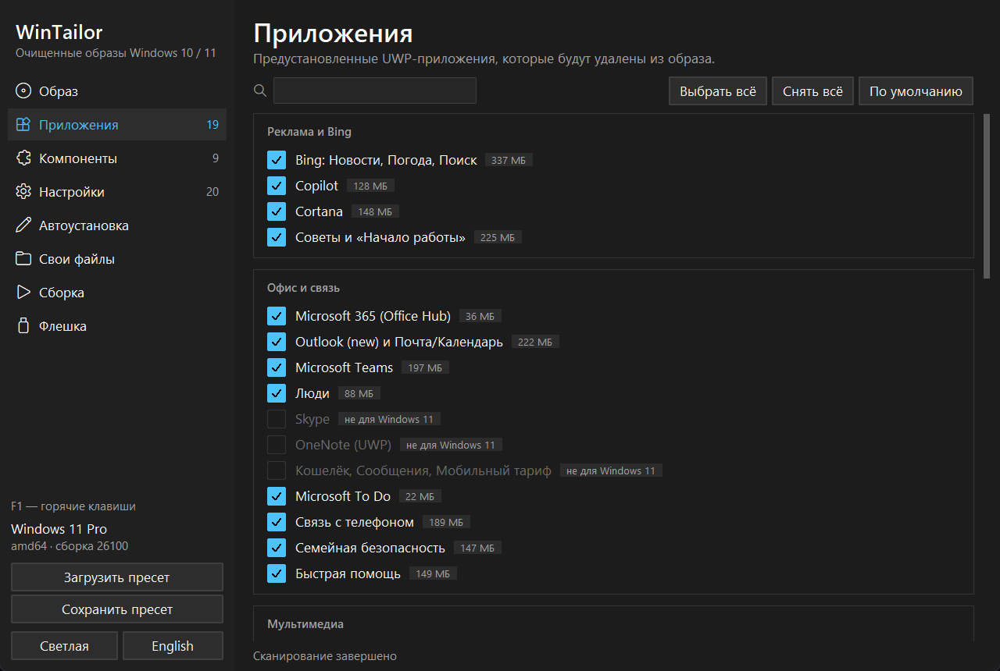
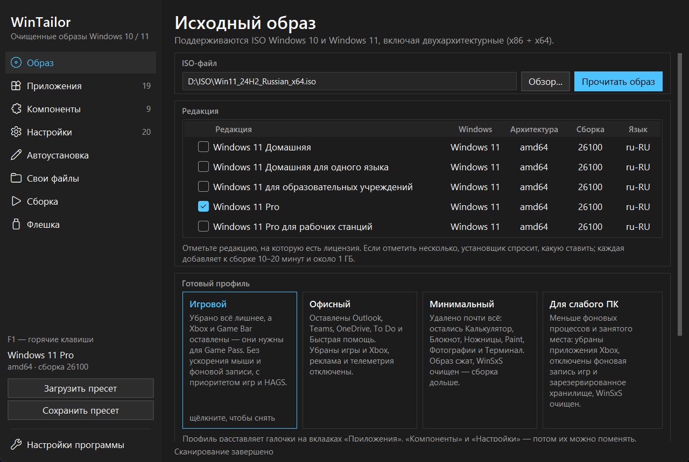
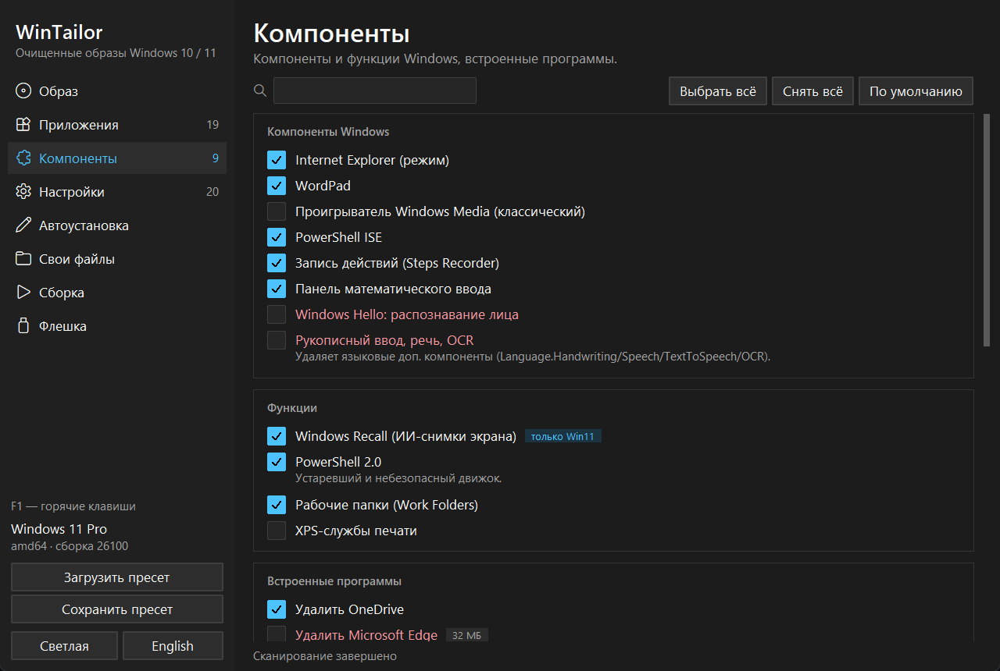
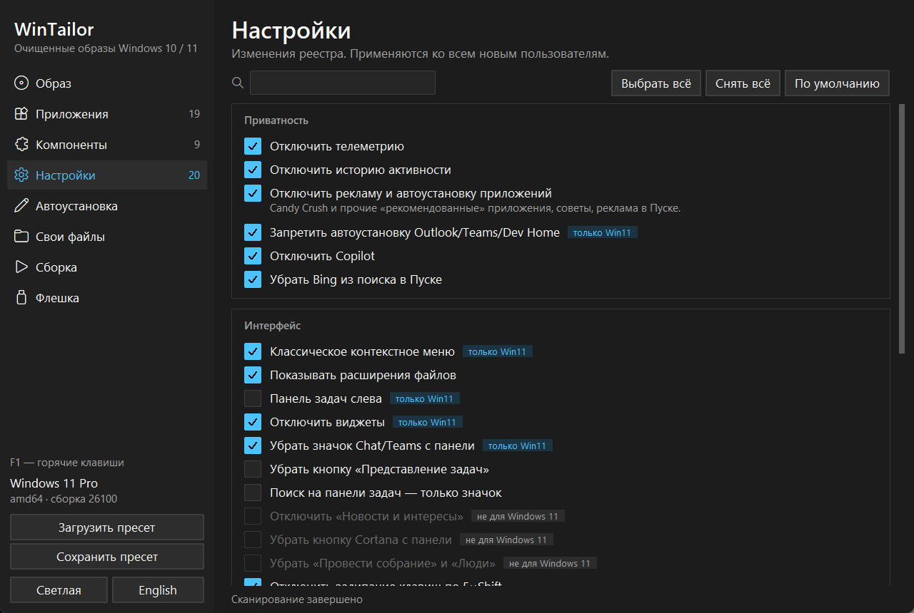
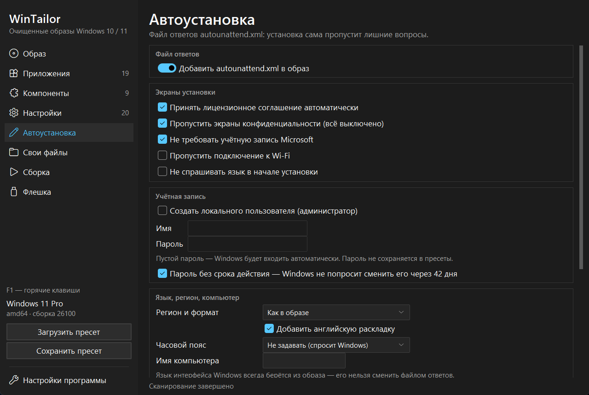
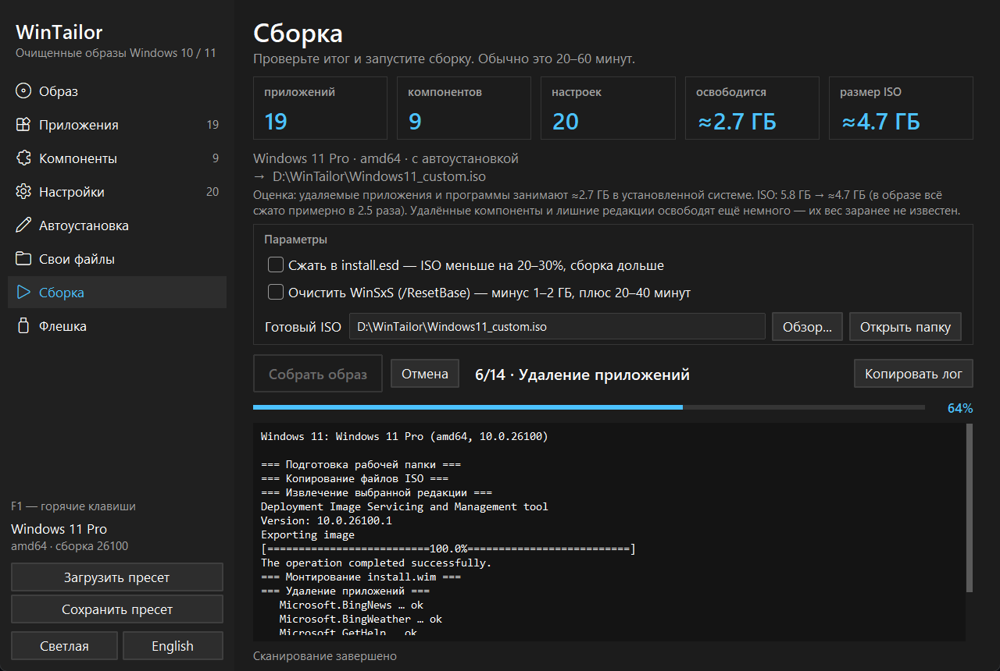
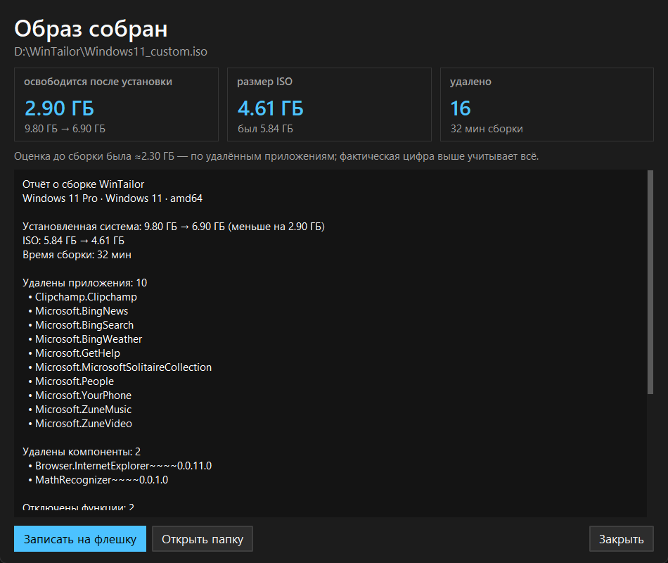
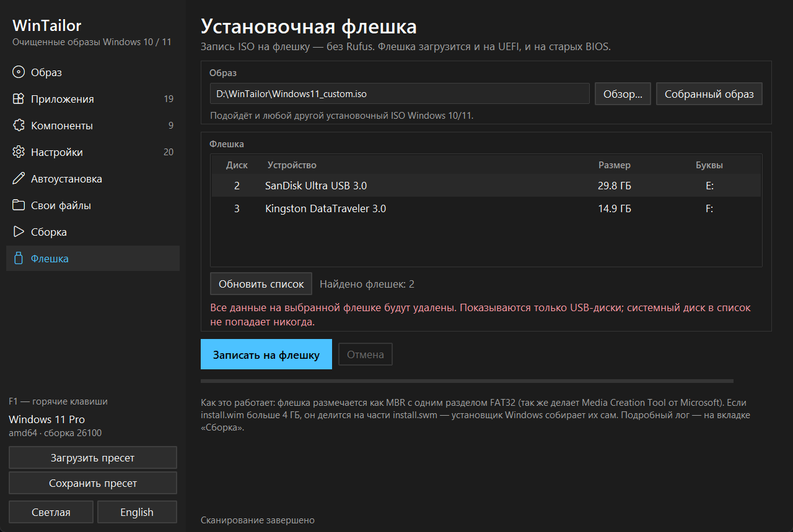
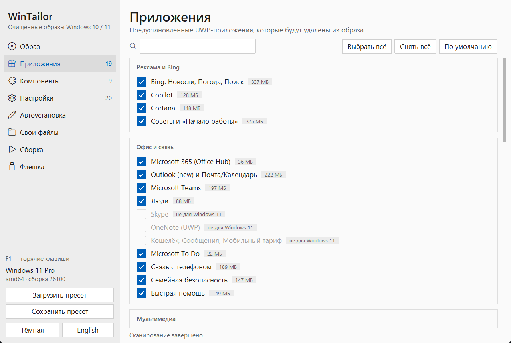

# WinTailor

**Русский** · [English](README.en.md)

**Чистая Windows 10 и 11 — без рекламы, телеметрии и лишних приложений.**
Выберите, что убрать и что настроить, — WinTailor соберёт установочный ISO или сразу запишет флешку.

---

## Зачем это

Свежая Windows 11 из коробки — это Bing в поиске, Copilot, Teams, Outlook, Clipchamp, игры, реклама в «Пуске», телеметрия и ещё десятки мелочей, которые после каждой переустановки приходится отключать руками.

WinTailor делает это **один раз — в самом образе**. Ставите Windows с такой флешки, и система сразу чистая: ничего не нужно удалять после установки, а все настройки уже применены для каждого нового пользователя.

- **Никаких скриптов и командной строки** — всё галочками, у каждого пункта объяснение.
- **Безопасно по умолчанию** — отмечено только то, что точно не сломает систему. Рискованные пункты подсвечены красным и выключены.
- **Видно, что внутри образа** — программа сканирует ISO, показывает, что реально в нём есть и сколько места занимает каждое приложение.
- **Без Rufus** — установочная флешка записывается прямо из программы.

## Скачать

1. Откройте страницу **[последнего релиза](https://github.com/kwolex/wintailor/releases/latest)**.
2. Скачайте `WinTailor-…-setup.exe` — установщик (или `WinTailor-…-portable.zip`, если не хотите ничего устанавливать).
   О следующих версиях программа сообщит сама — ссылка появится в боковом меню.
3. Запустите и установите как обычную программу. Python и другие программы ставить не нужно — всё уже внутри.

> **Windows SmartScreen** может предупредить, что издатель неизвестен: у программы пока нет платной цифровой подписи. Нажмите **«Подробнее» → «Выполнить в любом случае»**.

## Возможности

| | |
|---|---|
| 🧹 **39 приложений** | Bing, Copilot, Cortana, Teams, Outlook, Clipchamp, Xbox, пасьянсы, «Советы», Dev Home и другие — с размером каждого |
| ⚙️ **38 настроек** | Телеметрия, реклама, виджеты, классическое контекстное меню, тёмная тема, «Пуск» без рекомендаций, Проводник без «Главной» и «Галереи», игровые оптимизации |
| 🧩 **14 компонентов** | OneDrive, Edge, Internet Explorer, WordPad, PowerShell 2.0, Recall, распознавание лиц, рукописный ввод и др. |
| 🔍 **Сканирование образа** | Всё, чего нет в каталоге, показывается отдельным списком с оценкой риска: «безопасно», «осторожно», «опасно» |
| 🎮 **Готовые профили** | «Игровой», «Офисный», «Минимальный», «Для слабого ПК» — одним щелчком, повторный щелчок отменяет |
| 💻 **Установка на любой ПК** | Обход проверок TPM 2.0 / Secure Boot / процессора / памяти для Windows 11, установка без интернета и учётной записи Microsoft |
| 🤖 **Автоустановка** | Пропуск лицензии и экранов конфиденциальности, локальный пользователь с паролем без срока действия, регион, часовой пояс, имя компьютера |
| 📁 **Свои файлы** | Установщики, драйверы, конфиги — окажутся в `C:\Setup` или на рабочем столе сразу после установки. Просто перетащите их в окно из Проводника |
| 📊 **Отчёт после сборки** | Что удалено на самом деле, что не удалось и насколько меньше стала система. Рядом с ISO — полный лог и контрольная сумма SHA-256 |
| 💾 **Запись флешки** | Загружается и на UEFI, и на старых BIOS; большой `install.wim` делится автоматически |
| 🧰 **Ventoy** | Если на флешке стоит [Ventoy](https://www.ventoy.net), образ просто копируется на неё — без форматирования, остальные ISO остаются |
| 🗂️ **Несколько редакций** | Отметьте галочками, например, Pro и Home — установщик спросит, какую ставить |
| ⏯️ **Продолжение сборки** | Если сборка прервалась (сбой, выключили свет, нажали «Отмена»), следующая продолжит с того же места |
| 🏷️ **Сведения о производителе** | Своё имя производителя, модель, поддержка и логотип в «Параметры → Система → О программе» |
| 🔄 **Обновление в один клик** | Программа сама скачает и поставит новую версию |
| 🔔 **Не нужно ждать у экрана** | Значок в трее с ходом сборки, уведомление и звук по окончании, по желанию — сразу к записи флешки |

Интерфейс на русском и английском, тёмная и светлая темы, пресеты настроек, горячие клавиши (F1 — список). Выбранные галочки запоминаются между запусками, лог сборки можно скопировать целиком, а на значке в панели задач виден ход сборки — с уведомлением, когда она закончится.

## Как это выглядит

<table>
<tr>
<td width="50%"> <b>Образ.</b> Выбор ISO, редакции и готового профиля</td>
<td width="50%"> <b>Компоненты.</b> Рискованные пункты подсвечены красным</td>
</tr>
<tr>
<td> <b>Настройки.</b> Приватность, интерфейс, игры, установка</td>
<td> <b>Автоустановка.</b> Windows установится без лишних вопросов</td>
</tr>
<tr>
<td> <b>Сборка.</b> Оценка размера заранее и подробный лог</td>
<td> <b>Отчёт.</b> Сколько места освободилось на самом деле</td>
</tr>
<tr>
<td> <b>Флешка.</b> Запись без Rufus, только USB-диски</td>
<td> <b>Светлая тема</b></td>
</tr>
</table>

## Как пользоваться

1. **Скачайте ISO Windows** с сайта Microsoft: [Windows 11](https://www.microsoft.com/software-download/windows11) или [Windows 10](https://www.microsoft.com/software-download/windows10) (раздел «Создание установочного носителя» → образ ISO).
2. **Вкладка «Образ»:** укажите ISO и нажмите «Прочитать образ». Отметьте галочкой редакцию — ту, на которую у вас есть лицензия (обычно Pro или Домашняя).
3. *Необязательно, но полезно:* нажмите **«Сканировать образ»** — программа покажет всё, что есть внутри, и размер каждого приложения. Первый раз это несколько минут.
4. **Выберите профиль** или пройдитесь по вкладкам «Приложения», «Компоненты», «Настройки» и отметьте нужное. Если сомневаетесь — оставьте как есть: по умолчанию выбрано безопасное.
5. *Необязательно:* на вкладке **«Автоустановка»** включите пропуск лишних экранов и создание пользователя, а на вкладке **«Свои файлы»** добавьте установщики программ или драйверы.
6. **Вкладка «Сборка»** → «Собрать образ». Перед стартом откроется план сборки — полный список того, что будет удалено и изменено. Сама сборка обычно занимает 20–60 минут. В конце откроется отчёт. Готовый ISO по умолчанию сохраняется в `Документы\WinTailor` — путь виден и меняется здесь же, рядом кнопка «Открыть папку».
7. **Вкладка «Флешка»:** вставьте флешку от 8 ГБ, выберите её и нажмите «Записать». На флешку с Ventoy образ просто скопируется. Или запишите готовый ISO чем угодно другим.
8. Загрузитесь с флешки (обычно F8, F11 или F12 при включении компьютера) и установите Windows как обычно.

> 💡 Сохраните настройки кнопкой «Сохранить пресет» (Ctrl+S) — в следующий раз, с новой версией Windows, достаточно загрузить пресет и нажать «Собрать». Пресет также сохраняется рядом с каждым собранным ISO.

## Требования

- Windows 10 или 11 (64-разрядная) — на компьютере, где собирается образ.
- Права администратора — они нужны DISM, стандартному инструменту Windows для работы с образами. Программа запросит их сама.
- ~25 ГБ свободного места на NTFS-диске для рабочей папки.
- Флешка от 8 ГБ — для записи установочной флешки (все данные на ней будут удалены).

## Частые вопросы

<b>Это безопасно? Не сломается ли Windows?</b>

По умолчанию отмечены только пункты, которые не влияют на работу системы: реклама, предустановленные приложения, телеметрия. Всё, что может что-то сломать (Edge, Microsoft Store, распознавание лиц и т.п.), подсвечено красным, снабжено предупреждением и выключено. Программа не трогает ваш текущий компьютер — она меняет только копию образа в рабочей папке.

<b>Нужна ли лицензия? Это пиратство?</b>

Нет, это не пиратство. WinTailor работает с официальным ISO от Microsoft и ничего не делает с активацией. Выбирайте редакцию, на которую у вас есть лицензия: цифровая лицензия компьютера активирует Windows после установки автоматически.

<b>Можно ли вернуть удалённое приложение?</b>

Да, почти всё можно поставить обратно из Microsoft Store (если вы его не удаляли) или с сайта разработчика. Компоненты вроде WordPad и PowerShell ISE возвращаются через «Параметры → Приложения → Дополнительные компоненты».

<b>Будут ли приходить обновления Windows?</b>

Да. Центр обновления Windows не отключается, система обновляется как обычно. Крупные обновления (например, 24H2 → 25H2) могут вернуть часть приложений — тогда просто соберите образ заново с тем же пресетом.

<b>Антивирус ругается на программу</b>

Программа запрашивает права администратора и работает с образами Windows и реестром — эвристика некоторых антивирусов реагирует на такое поведение у новых неподписанных программ. Скачивайте WinTailor только со [страницы релизов](https://github.com/kwolex/wintailor/releases) этого репозитория.

<b>Чем это отличается от NTLite или tiny11?</b>

NTLite — мощный профессиональный инструмент, но платный и сложный для новичка. tiny11 — готовый скрипт с фиксированным набором удалений. WinTailor посередине: бесплатно, всё галочками с объяснениями, видно содержимое образа и его размер, а флешка записывается прямо из программы.

<b>Где программа хранит файлы? Как её удалить?</b>

Программа ставится в `Program Files`, рабочие файлы (кэш образа — 5–10 ГБ, настройки, пресеты) лежат в `%LOCALAPPDATA%\WinTailor`, готовые ISO — в `Документы\WinTailor`. Удаляется через «Параметры → Приложения»; при удалении программа спросит, стереть ли рабочие файлы. Собранные ISO не удаляются никогда.

## Сообщить об ошибке

Нашли ошибку или есть идея — откройте [issue](https://github.com/kwolex/wintailor/issues). Приложите лог `*.log` и отчёт `*.report.txt` — они лежат рядом с собранным ISO (лог сохраняется и когда сборка не удалась).

---

WinTailor не связан с Microsoft. Windows — товарный знак Microsoft Corporation. Программа распространяется «как есть»; перед установкой на рабочий компьютер сохраните важные данные.
